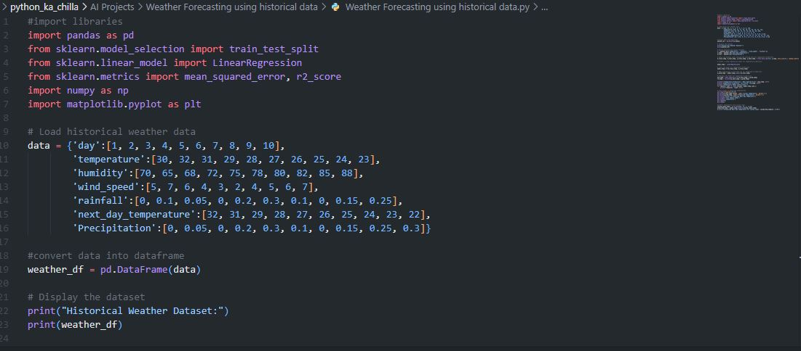
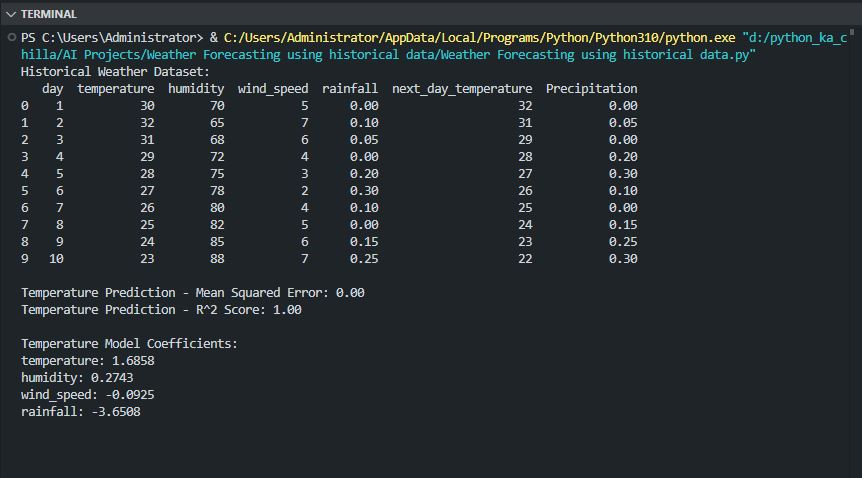
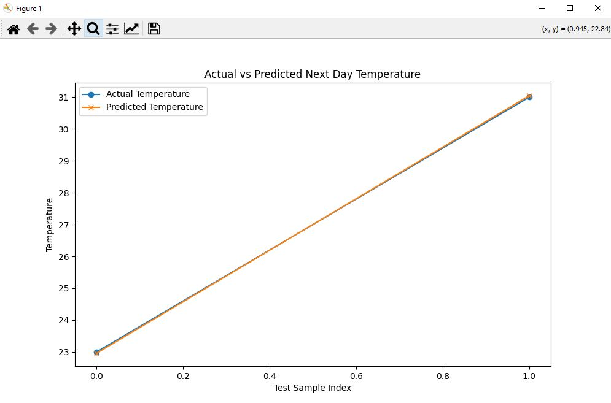

# 🌦️ Weather Forecasting using Linear Regression 🤖  
    

<p align="center">
  
</p>

🚀 This project implements a **weather forecasting model** using **Linear Regression** to predict the next day's temperature and precipitation based on historical weather data. It loads a small synthetic dataset, splits it into training and testing sets, trains a regression model, and evaluates its performance using Mean Squared Error and R² score. The model's coefficients are displayed, and a comparison plot of actual vs. predicted temperatures is generated.

---

## ✨ Key Features  
📊 **Data Loading** – Reads historical weather data (temperature, humidity, wind speed, rainfall)  
🧹 **Data Preparation** – Converts data into a pandas DataFrame for easy manipulation  
🧠 **Model Training** – Uses `LinearRegression` from scikit‑learn to predict next‑day temperature and precipitation  
📈 **Model Evaluation** – Computes Mean Squared Error (MSE) and R² score  
📉 **Visualization** – Plots actual vs. predicted next‑day temperatures with Matplotlib  
🔮 **Custom Prediction** – Allows prediction for user‑provided weather conditions  

---

## 🧠 Tech Stack  
- **Language:** Python 🐍  
- **Libraries:**  
  - `pandas` – Data manipulation  
  - `scikit-learn` – Machine learning (train/test split, linear regression, metrics)  
  - `numpy` – Numerical operations  
  - `matplotlib` – Plotting  

---

## 📦 Installation  

```bash
git clone https://github.com/SayabArshad/Weather-Forecasting-Linear-Regression.git
cd Weather-Forecasting-Linear-Regression
pip install pandas scikit-learn numpy matplotlib
```

---

## ▶️ Usage

Run the main script:

```bash
python "Weather Forecasting using historical data.py"
```
The script will:

Print the loaded historical weather dataset.

Split the data (80% training, 20% testing) for temperature prediction.

Train a linear regression model using features: temperature, humidity, wind_speed, rainfall to predict next_day_temperature.

Display model performance metrics and coefficients.

Show a plot comparing actual vs. predicted temperatures for the test set.

Predict the next‑day temperature for a custom input (e.g., temperature=28, humidity=75, wind_speed=3, rainfall=0.2).

Sample output:
(see the Output Preview below)

---


## 📁 Project Structure

```
Weather-Forecasting-Linear-Regression/
│-- Weather Forecasting using historical data.py   # Main script
│-- README.md                                       # Documentation
│-- assets/                                          # Images for README
│    ├── code.JPG
│    ├── output.JPG
│    └── plot.JPG
```
---

## 🖼️ Interface Previews

| 📝 Code Snippet | 📊 Console Output | 📈 Prediction Plot |
|:---------------:|:-----------------:|:------------------:|
|  |  |  |t.JPG

---

## 💡 How It Works – Linear Regression for Weather Forecasting

Linear Regression models the relationship between a dependent variable (target) and one or more independent variables (features) by fitting a linear equation.

In this project:

Features (X):

temperature (current day)

humidity

wind_speed

rainfall

Targets (y):

next_day_temperature

Precipitation (only used in the dataset but not modeled here – the code shows both but only trains temperature; precipitation is left for extension)

The dataset is split into training (80%) and testing (20%) sets. The model learns coefficients for each feature that minimize the Mean Squared Error between predicted and actual next‑day temperatures. The R² score indicates how well the model explains the variance in the target.

Model Coefficients Example (from output):

temperature: 1.6858

humidity: 0.2743

wind_speed: -0.0925

rainfall: -3.6508

These coefficients tell us how each feature influences the next day's temperature. For instance, a one‑unit increase in current temperature raises the next day's temperature by about 1.69°C, while higher rainfall tends to decrease it.

---

## 🧑‍💻 Author

**Developed by:** [Sayab Arshad Soduzai](https://github.com/SayabArshad) 👨‍💻

📅 **Version:** 1.0.0

📜 **License:** MIT License

---

## ⭐ Contributions

Contributions are welcome! Fork the repository, open issues, or submit pull requests. Ideas for improvement:

Add precipitation prediction using a separate model.

Use more advanced algorithms (Random Forest, XGBoost).

Incorporate real‑world weather data from APIs.

Build a web interface for user‑friendly predictions.

If you find this project helpful, please ⭐ star the repository to show your support!

---

## 📧 Contact

For queries, collaborations, or feedback, reach out at **[sayabarshad789@gmail.com](mailto:sayabarshad789@gmail.com)**


---

🌤️ Predict tomorrow's weather – one line of code at a time.

---
